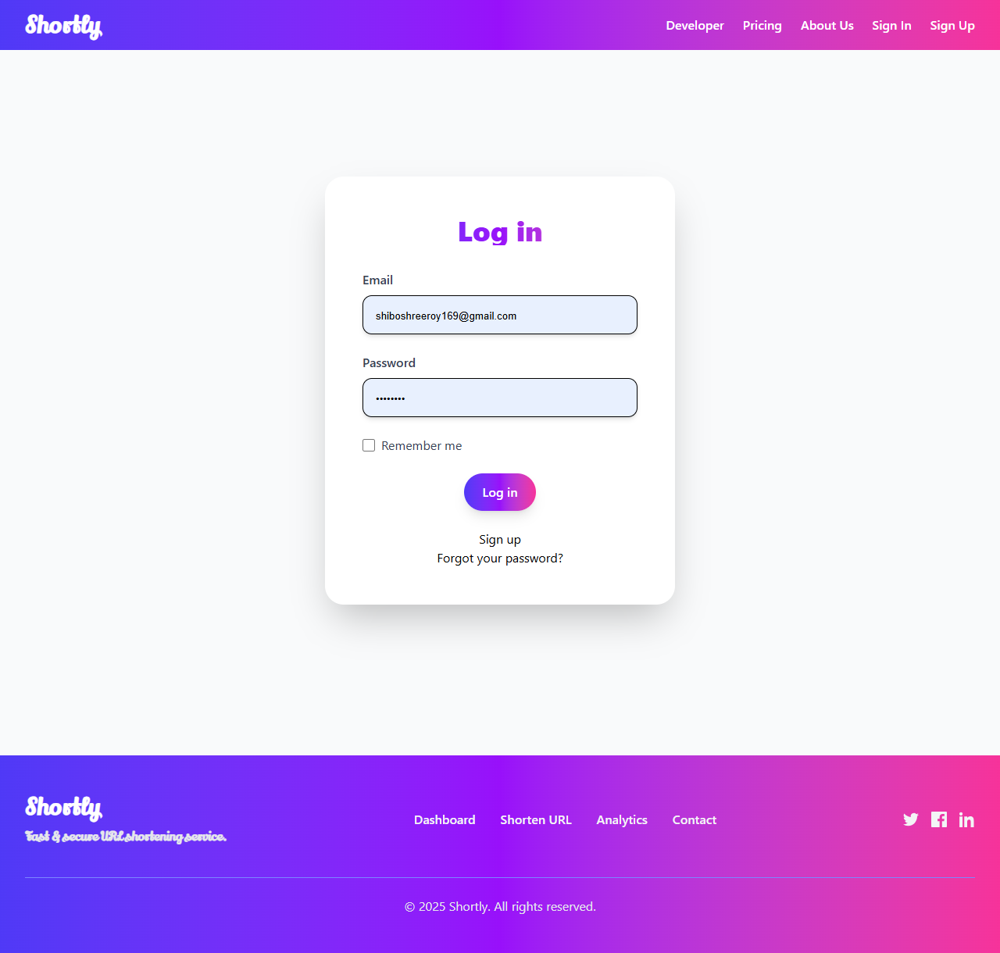
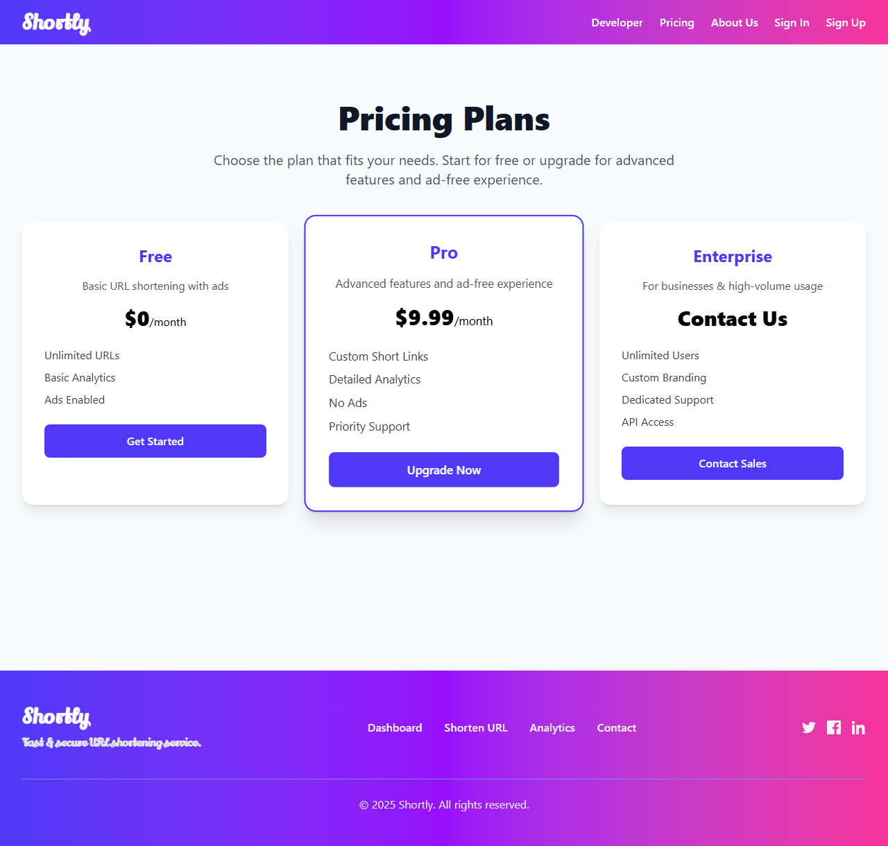
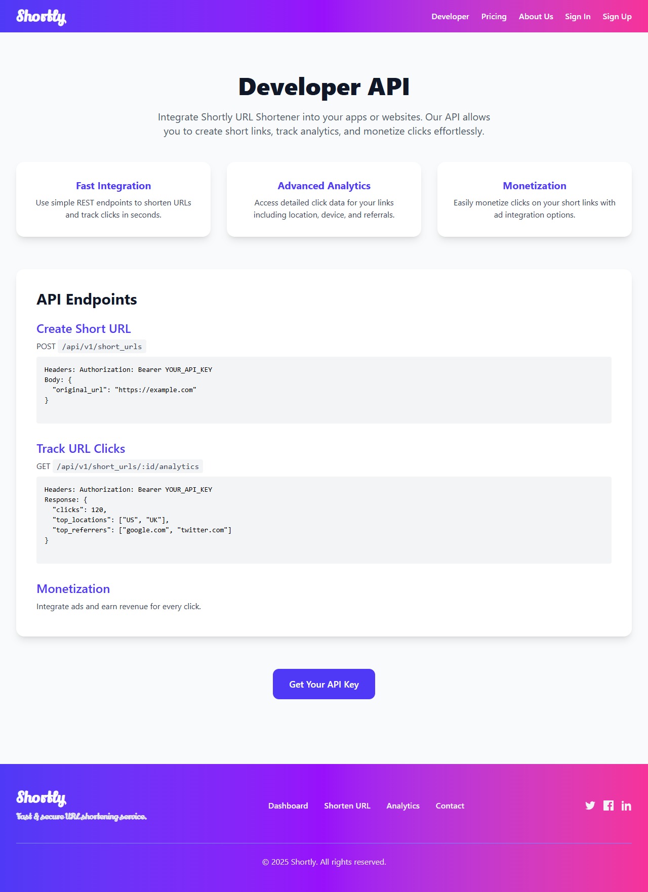
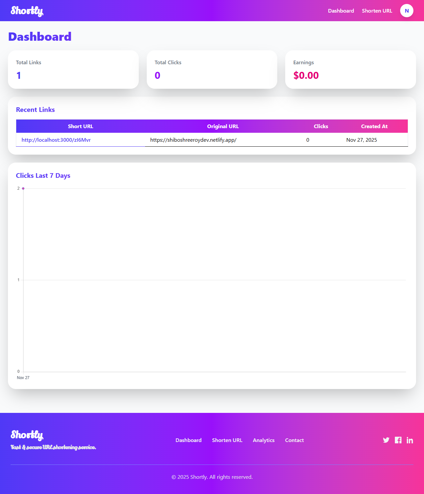

# Shortly - URL Shortener With Ads

[](LICENSE)  
  
  
  
  
  
  

**Shortly** is a modern URL shortening and monetization platform built with **Ruby on Rails 7**. Users can shorten links, share them, and monetize clicks with integrated ads. It includes analytics, user authentication, and a professional SaaS-style interface.

---

## **Table of Contents**

- [Features](#features)  
- [Demo](#demo)  
- [Technologies](#technologies)  
- [Installation](#installation)  
- [Usage](#usage)  
- [Screenshots](#screenshots)  
- [Contributing](#contributing)  
- [License](#license)  

---

## **Features**

- Shorten URLs with custom aliases  
- Click countdown page for ad display  
- Multiple ad formats (banner, interstitial, etc.)  
- Analytics dashboard for link performance  
- Fraud detection and prevention  
- User authentication with Devise  
- Responsive, premium GUI (TailwindCSS)  
- Developer API for integration  
- Multiple pricing plans (Free, Pro, Enterprise)  

---

## **Demo**

_You can deploy it locally or host it on Heroku, Render, or any Rails-friendly platform._  

- Homepage: `/`  
- Developer API Docs: `/developer`  
- Pricing Page: `/pricing`  
- About Page: `/about`  

---

## **Technologies**

| Technology | Version | Icon |
|------------|---------|------|
| Ruby       | 3.2.2   |  |
| Rails      | 7.1.0   |  |
| TailwindCSS| 3.3.2   |  |
| PostgreSQL | 16      |  |
| StimulusJS | 3.2.1   |  |
| Hotwire    | 1.2.3   |  |

---

## **Installation**

1. **Clone the repository**

```bash
git clone https://github.com/shiboshreeroy/shortly.git
cd shortly
````

2. **Install dependencies**

```bash
bundle install
yarn install
```

3. **Setup database**

```bash
rails db:create
rails db:migrate
rails db:seed
```

4. **Start the server**

```bash
rails server
```

5. Visit `http://localhost:3000` in your browser.

---

## **Usage**

* Sign up as a user to create and manage shortened URLs.
* Click on **Developer** for API access and documentation.
* Click on **Pricing** to see subscription plans.
* Use the dashboard to view analytics and earnings.
* Mobile-friendly, responsive design for all devices.

---

## **Screenshots**


---

---

---


---

## **Contributing**

We welcome contributions!

1. Fork the repository
2. Create a new branch: `git checkout -b feature/my-feature`
3. Commit your changes: `git commit -m 'Add my feature'`
4. Push to the branch: `git push origin feature/my-feature`
5. Open a Pull Request

---

## **License**

This project is licensed under the **MIT License** - see the [LICENSE](LICENSE) file for details.

---

**Made with ❤️ by Shiboshree Roy**
